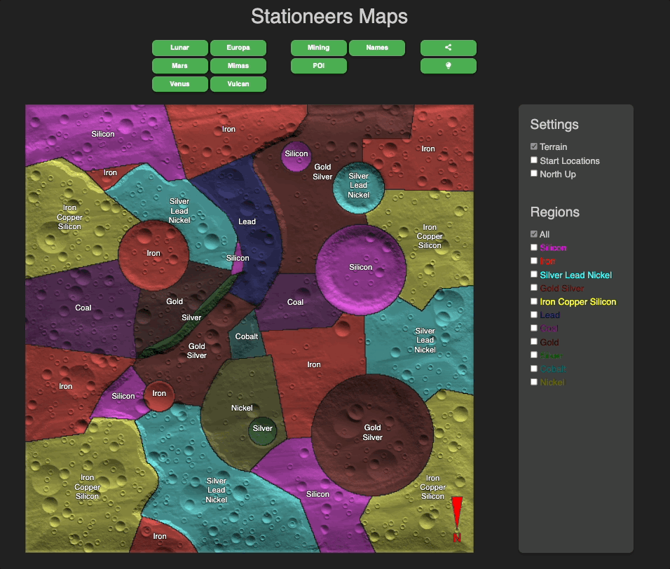

# Stationeers Deep Mining Map

Original Live version at
https://aproposmath.github.io/stationeers-deepmining-map

This fork live at
https://siteworxpro.github.io/stationeers-deepmining-map/

### improvements
- Updated to use vite and add docker support.
- Code updated to typeScript.
- tailwindcss added for styling.
- light and dark mode support.
- settings saved in local storage.

Running Stationeers Deep Mining Map in Docker
```shell
docker run --rm -p 8080:80 siteworxpro/stationeers-deepmining-map:latest
```

You can access the map at: [http://localhost:8080](http://localhost:8080)



### Developing Locally

To run the Stationeers Deep Mining Map locally for development, follow these steps:

```bash
git clone https://github.com/siteworxpro/stationeers-deepmining-map.git
cd stationeers-deepmining-map/js
nvm install && nvm use
npm i && npm run dev
``` 